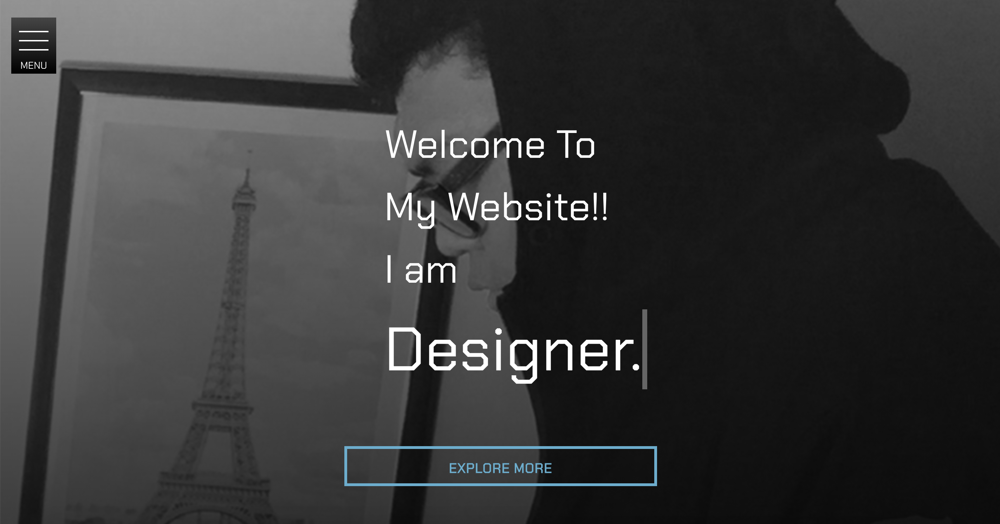
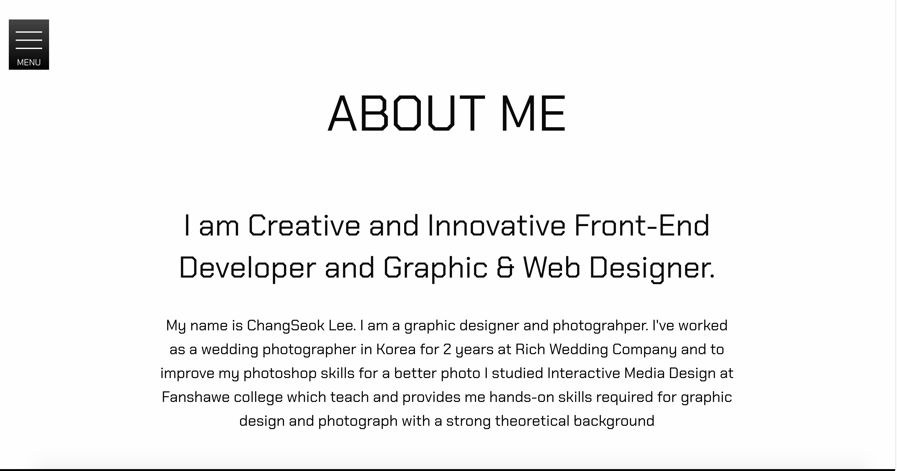
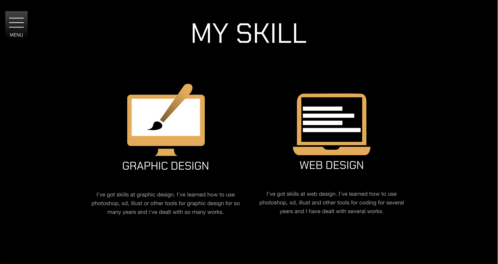
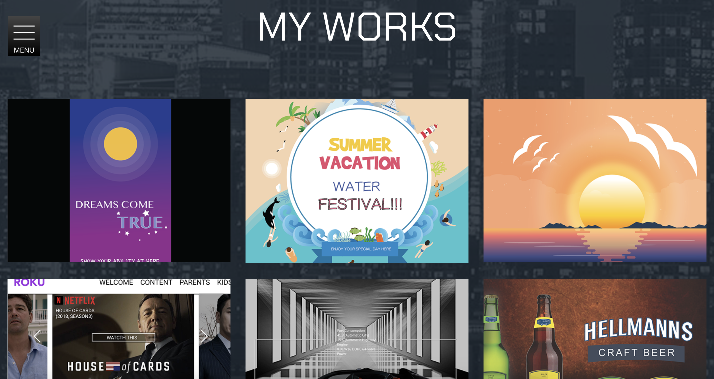
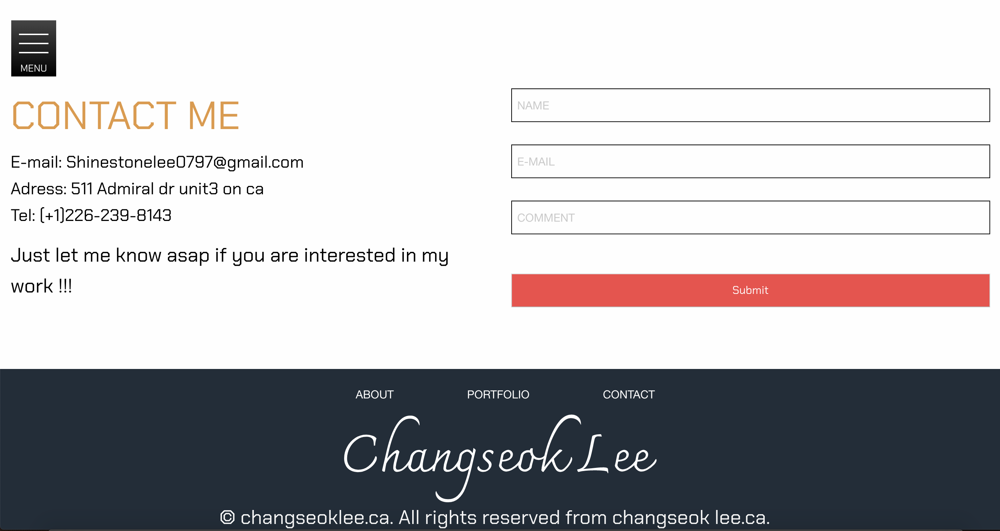

# Hi, this is my Portfolio 

The concept idea was to create and to show an iconic graphic that captures the essence of my achievements.
Where I am standing now, and where I will be in the future.

### About section

The Concept of this section is just showing some breif description about me like what was my previous job in Korea, why I chose to decided to study Interactive media design In CANADA.

### SKILLS. section

The Concept of this page is just showing what kinds of skills I have with some logo animations. And
The Skills section briefly surmmarized about me like how many years I learned those skills and which part I can handle.

### Work. section

This Section shows about my graphic design works and some of my school project works.

### CONTACT. section

The contact section offers different way to communicate or connect with me.

### Author
Changseok Lee(Developer, Designer)

## Tools used during development phase:
- Adobe Illustrator, Photoshop, XD
- PHP/MySQL
- Gulp.js
- SASS
- Javascript Fetch API, to get data from backend database
- Fonts: Charkra Petch and Chamonman

### Future Improvements
- Animations improvements
- Further refactoring SASS structure
- Backend and Database to be expanded
